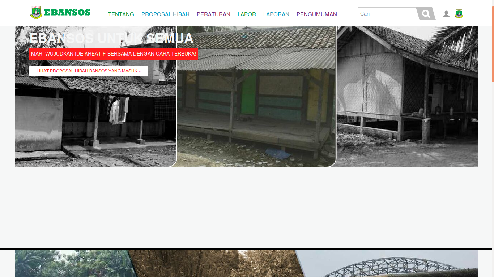
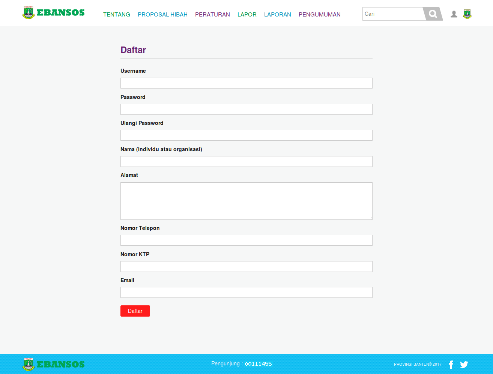
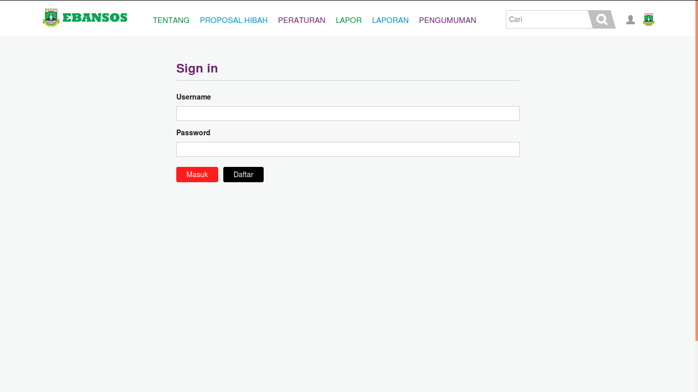
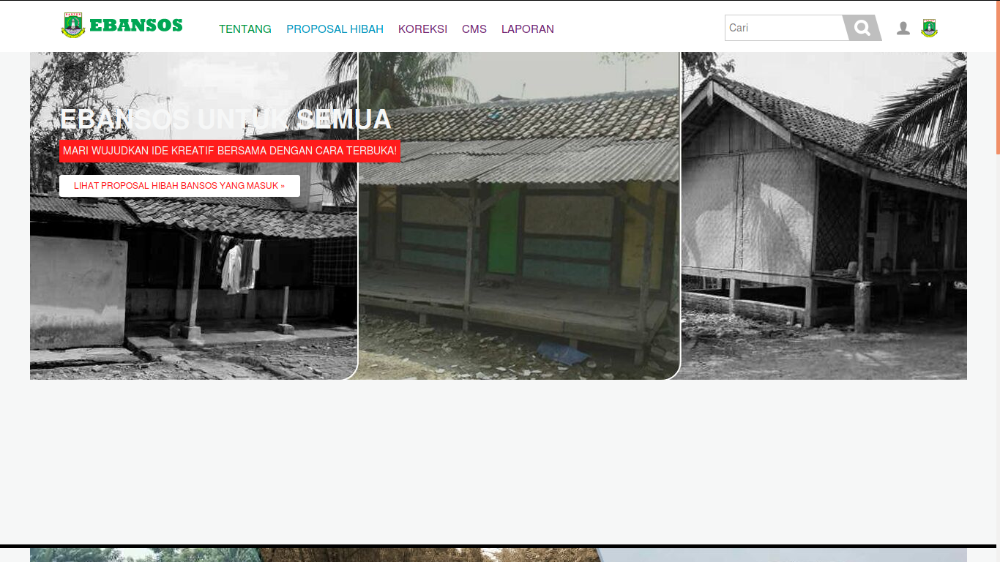

## Aplikasi E-Bansos (elektrik bantuan sosial)

---

### Layana e-bansos
- E-BANSOS adalah aplikasi berbasis web yang memberikan informasi mengenai tentang bantuan sosial yang terdapat di Banten. |
- Aplikasi ini dilengkapi dengan informasi mengenai bantuan sosial dan hibah yang terdapat di Provinsi Banten. |

---

### e-bansos features
- Mudah digunakan oleh masyarakat banyak. |
- Tampilan yang menarik. |
- Masyarakat dapat berkonsultasi dengan admin atau super admin secara langsung. |
- Memudahkan dalam mencari informasi mengenai bantuan sosial dan hibah. |

---

### Tujuan Pengembangan e-bansos
- Untuk memprmudah masyarakat dalam mencari informasi bantuan sosial dan hibah di Provinsi Banten. |
- Untuk mempermudah pengelolaan manajemen e-bansos. |
- untuk mempermudah pendataan masyarakat yang ingin mengajui proposal bantuan sosial atau hibah. |
- Untuk mempermudah pendataan jumlah masyatakat agar lebh teratur yang terdapat di provinsi Banten. |

---

### Tampilan Aplikasi e-bansos

#### Tampilan Home

---

#### Tampilan daftar

+++

##### Tampilan login

---

#### Tampilan Super Admin

+++

##### Tampilan Menu
![Tampilan Menu]

---

#### Tampilan Proposal Hibah
![Tampilan Proposal Hibah]

+++

##### Tampilan Laporan
![Tampilan Laporan]

---

#### Tampilan CMS
![Tampilan CMS]

---

#### Tampilan Pengumuman
![Tampilan Pengumuman]
